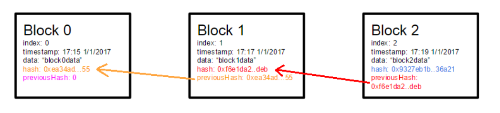
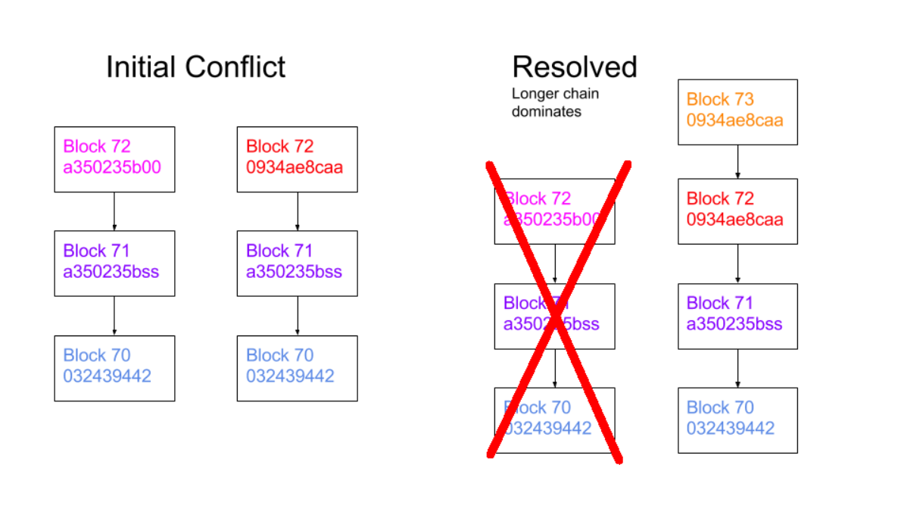
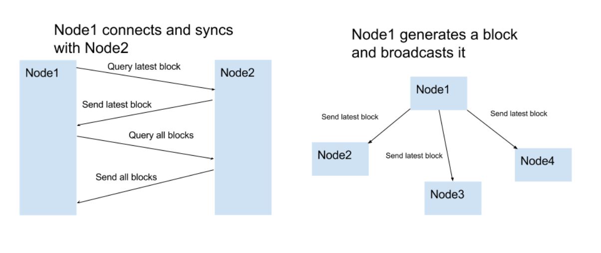
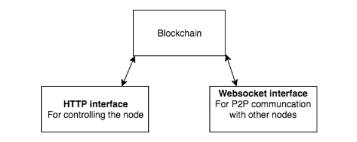

200行代码实现区块链
-----
> 翻译自[原文链接](https://medium.com/@lhartikk/a-blockchain-in-200-lines-of-code-963cc1cc0e54)

区块链的基本概念非常简单：一个分布式数据库，它维护着不断增长的有序记录列表。然而，当我们谈论区块链时，通常会谈论我们试图用它们解决的问题时，很容易混淆。在比特币和以太坊等流行的基于区块链的项目中就是这种情况 。“区块链”一词通常与交易，智能合约或加密货币等概念密切相关。  

这使得理解区块链成为必然的艰巨任务。特别是源代码。在这里，我将介绍一个超级简单的区块链，我在200行Javascript中实现了一个名为NaiveChain。

### 块结构
第一个逻辑步骤是确定块结构。为了使事情尽可能简单，我们只包括最必要的：索引，时间戳，数据，哈希和前一个哈希。  


### 块哈希
需要对块进行哈希处理以保持数据的完整性。SHA-256接受块的内容。应该注意的是，这个哈希与“ 挖掘 ” 无关，因为没有要解决的工作证明问题。


### 生成一个块
要生成块，我们必须知道前一个块的散列并创建剩余的所需内容（=索引，散列，数据和时间戳）。块数据是最终用户提供的。


### 存储块
内存中的Javascript数组用于存储区块链。区块链的第一个区块总是所谓的“创世块”，它是硬编码的。


### 验证块的完整性
在任何给定时间，我们必须能够验证块或块链在完整性方面是否有效。特别是当我们从其他节点接收新块并且必须决定是否接受它们时，情况确实如此。


### 选择最长的链条
在给定时间，链中应始终只有一个明确的块集。如果发生冲突（例如，两个节点都生成块号72），我们选择具有最长块数的链。



### 与其他节点通信
节点的一个重要部分是与其他节点共享和同步区块链。以下规则用于使网络保持同步。  

* 当节点生成新块时，它会将其广播到网络
* 当节点连接到新对等体时，它会查询最新块
* 当节点遇到索引大于当前已知块的块时，它会将块添加到其当前链或查询完整的区块链。



不使用自动对等发现。必须手动添加对等体的位置（= URL）。

### 控制节点
用户必须能够以某种方式控制节点。这是通过设置HTTP服务器来完成的。  
  
如图所示，用户可以通过以下方式与节点进行交互：

* 列出所有块
* 使用用户指定的内容创建新块
* 列出或添加同行

控制节点最直接的方法是使用Curl：

```bash
#get节点中的所有块
curl http://localhost:3001/blocks
```

### 建筑
应该注意的是，节点实际上暴露了两个Web服务器：一个用于用户控制节点（HTTP服务器），一个用于节点之间的对等通信。（Websocket HTTP服务器）



### 总结
NaiveChain是为了演示和学习目的而创建的。因为它不具有“ 挖掘 ”算法（销售点的战俘），它可以在公共网络中不使用。尽管如此，它仍然实现了功能区块链的基本功能。  

您可以查看Github存储库以获取更多技术细节。

如果您想了解更多关于区块链的信息，我建议您查看Naivecoin：一个构建加密货币的教程。在本教程中，我们将更多地讨论挖掘（工作量证明），交易和钱包。