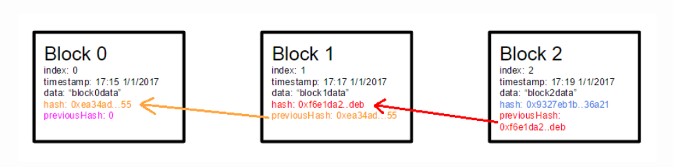

区块链的最小化原型
---
> 查看[原文链接](https://lhartikk.github.io/jekyll/update/2017/07/14/chapter1.html)

#### 概览
基础的区块链的概念还是时分简单的：一个用来维护不断增长的有序列表记录的分布式数据库。本节，我们讲实现一个简单版本的区块链。这个区块链具有以下功能特点：
* 区块和区块链结构
* 添加区块方法 -- 可使用任意数据像区块链中添加区块
* 区块链节点 -- 节点与节点之间可以通讯和同步
* 简单的HTTP服务 -- 用来控制节点

#### 区块结构
我们先从顶一个区块开始。此时，区块还只包含一些基本的属性。

* index : 当前区块在区块链中的高度（索引）
* data: 区块包含的数据
* timestamp: 区块创建的时间戳
* hash: 由区块内容生成的 sha256 哈希
* previousHash: 上一个区块的哈希



代码实现如下：
```js
class Block {

    public index: number;
    public hash: string;
    public previousHash: string;
    public timestamp: number;
    public data: string;

    constructor(index: number, hash: string, previousHash: string, timestamp: number, data: string) {
        this.index = index;
        this.previousHash = previousHash;
        this.timestamp = timestamp;
        this.data = data;
        this.hash = hash;
    }
}
```

#### 区块哈希
区块哈希是区块最重要地属性之一。它使用区块包含地所有数据计算得来。也就是说，一旦区块地任一属性发生了变化，之前的区块哈希将会无法使用。区块哈希可以被看作是区块的唯一标识。事实上，区块之间的索引可能会一样，但是区块哈希仍然是唯一的。  
  
我们使用下面的代码来计算区块哈希：
```js
const calculateHash = (index: number, previousHash: string, timestamp: number, data: string): string =>
    CryptoJS.SHA256(index + previousHash + timestamp + data).toString();
```

要说明的是，此时的区块哈希还不能用于挖矿，因为我们还没有解决工作量证明的问题（第二节会介绍）。现在我们只是，使用这个hash来保证完整的区块数据和显示的表示前一个区块。  

`hash` 和 `previousHash` 属性的重要性在于 -- 在不改变整个链中连续不断的区块的hash
