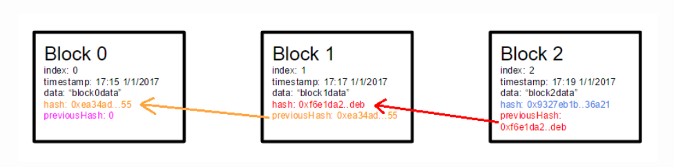
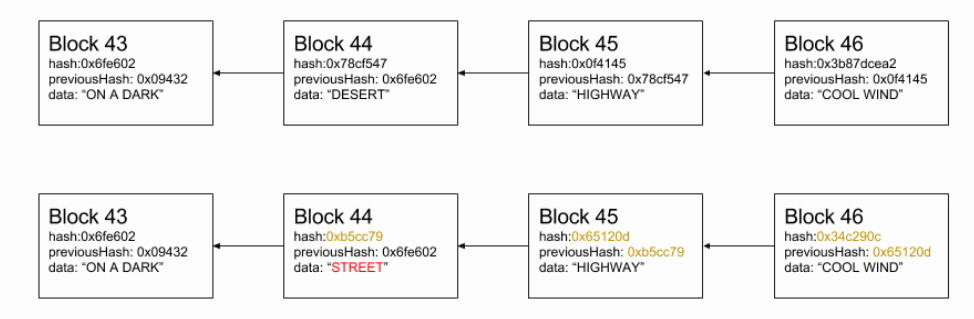
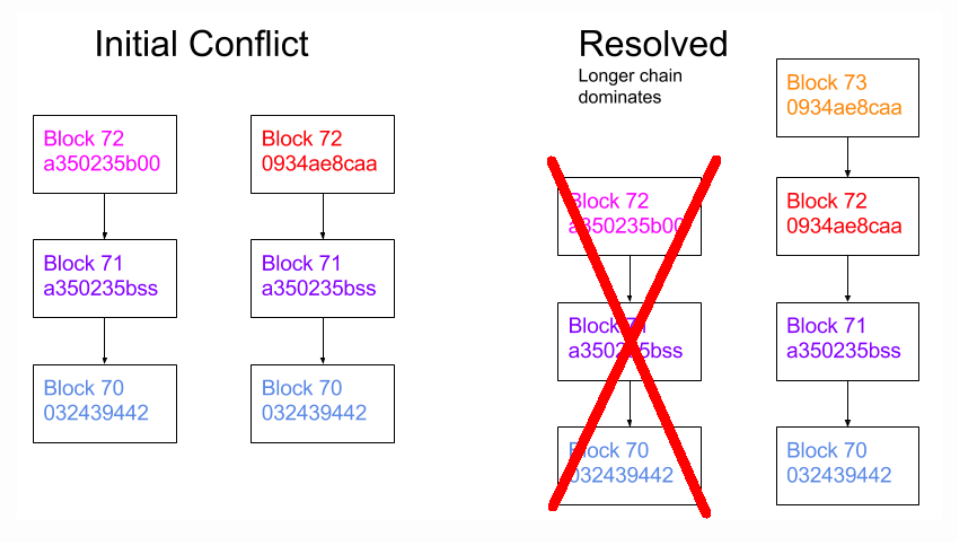
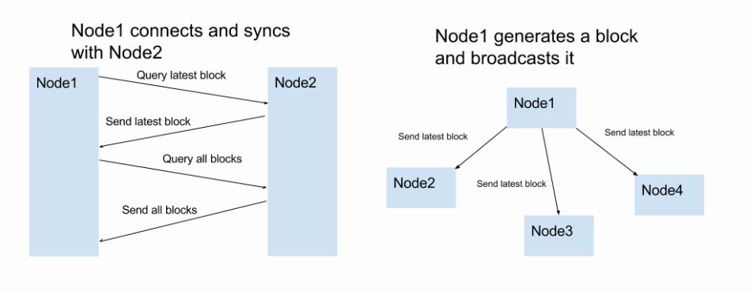
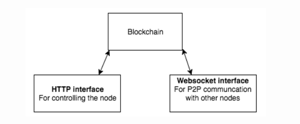

区块链的最小化原型
---
> 查看[原文链接](https://lhartikk.github.io/jekyll/update/2017/07/14/chapter1.html)

#### 概览
基础的区块链的概念还是时分简单的：一个用来维护不断增长的有序列表记录的分布式数据库。本节，我们讲实现一个简单版本的区块链。这个区块链具有以下功能特点：
* 区块和区块链结构
* 添加区块方法 -- 可使用任意数据像区块链中添加区块
* 区块链节点 -- 节点与节点之间可以通讯和同步
* 简单的HTTP服务 -- 用来控制节点

#### 区块结构
我们先从顶一个区块开始。此时，区块还只包含一些基本的属性。

* index : 当前区块在区块链中的高度（索引）
* data: 区块包含的数据
* timestamp: 区块创建的时间戳
* hash: 由区块内容生成的 sha256 哈希
* previousHash: 上一个区块的哈希



代码实现如下：
```js
class Block {

    public index: number;
    public hash: string;
    public previousHash: string;
    public timestamp: number;
    public data: string;

    constructor(index: number, hash: string, previousHash: string, timestamp: number, data: string) {
        this.index = index;
        this.previousHash = previousHash;
        this.timestamp = timestamp;
        this.data = data;
        this.hash = hash;
    }
}
```

#### 区块哈希
区块哈希是区块最重要地属性之一。它使用区块包含地所有数据计算得来。也就是说，一旦区块地任一属性发生了变化，之前的区块哈希将会无法使用。区块哈希可以被看作是区块的唯一标识。事实上，区块之间的索引可能会一样，但是区块哈希仍然是唯一的。  
  
我们使用下面的代码来计算区块哈希：
```js
const calculateHash = (index: number, previousHash: string, timestamp: number, data: string): string =>
    CryptoJS.SHA256(index + previousHash + timestamp + data).toString();
```

要说明的是，此时的区块哈希还不能用于挖矿，因为我们还没有解决工作量证明的问题（第二节会介绍）。现在我们只是，使用这个hash来保证完整的区块数据和显示的表示前一个区块。  

`hash` 和 `previousHash` 属性的重要性在于 -- 在不改变整个链中连续的区块哈希的情况下，区块时无法被修改的。  

下面演示一个示例:如果把`区块44`的数据`DESERT`改为`STREET`,那`区块44`连接的上有区块都要被改变。这是因为每一个区块的哈希的生成都依赖于`previousHash`（上一个区块的哈希）的值。因此，我们可以知道区块链中越是后来加入的区块，就越难被改变。
  

这对于第二节要介绍的`工作量证明`时非常重要的一个属性。

#### 创世区块
创世纪是整个区块链中的第一块。这是唯一没有`previousHash`块。下面我们在代码中编写创世区块的代码:
```js
const genesisBlock: Block = new Block(
    0,  // index
    '816534932c2b7154836da6afc367695e6337db8a921823784c14378abed4f7d7',  // hash
    null, // previousHash
    1465154705, // timestamp
    'my genesis block!!' // data
);
```

#### 生成区块
想要生成一个区块，我们首先需哟啊知道上一个区块的hash,和剩下的数据(index、hash、timestamp、data)。其中，区块的数据（data），是由用户(外层)提供的，看代码：
```js
const generateNextBlock = (blockData: string) => {
    const previousBlock: Block = getLatestBlock();
    const nextIndex: number = previousBlock.index + 1;
    const nextTimestamp: number = new Date().getTime() / 1000;
    const nextHash: string = calculateHash(nextIndex, previousBlock.hash, nextTimestamp, blockData);
    const newBlock: Block = new Block(nextIndex, nextHash, previousBlock.hash, nextTimestamp, blockData);
    return newBlock;
};
```

#### 存储区块链
我们先使用JS的数组来把区块链存储在内存里面。当然，这样的话，节点终止的时候，数据并不会保存下来。
```js
const blockchain: Block[] = [genesisBlock];
```

#### 验证区块的有效性
在任何时候，我们必须能够验证一个区块或一条链是有效的。特别是当我们从其他节点获取新的区块时(更新区块)，需要通过有效性来决定是否把这些区块加入到我们自己的链中。  

验证一个区块的有效性，需要做到以下几点：
1. 该区块的索引必须比它前一个区块的索引大
2. 该区块的 `previousHash` 必须和前一个区块的 `hash` 能匹配
3. 该区块自己的 `hash` 必须时有效的

实现代码如下：
```js
const isValidNewBlock = (newBlock: Block, previousBlock: Block) => {
    if (previousBlock.index + 1 !== newBlock.index) {
        console.log('invalid index');
        return false;
    } else if (previousBlock.hash !== newBlock.previousHash) {
        console.log('invalid previoushash');
        return false;
    } else if (calculateHashForBlock(newBlock) !== newBlock.hash) {
        console.log(typeof (newBlock.hash) + ' ' + typeof calculateHashForBlock(newBlock));
        console.log('invalid hash: ' + calculateHashForBlock(newBlock) + ' ' + newBlock.hash);
        return false;
    }
    return true;
};
```

我们还必须验证块的结构, 以避免别人发送的有问题的内容让我们的节点崩溃。
```js
const isValidBlockStructure = (block: Block): boolean => {
    return typeof block.index === 'number'
        && typeof block.hash === 'string'
        && typeof block.previousHash === 'string'
        && typeof block.timestamp === 'number'
        && typeof block.data === 'string';
};
```
现在我们可以通过验证区块的方法，来检验一个区块链的有效性。首先，检查下第一个区块是不是创世区块，然后使用上面定义的方法来校验每一个区块。代码实现如下：
```js
const isValidChain = (blockchainToValidate: Block[]): boolean => {
    const isValidGenesis = (block: Block): boolean => {
        return JSON.stringify(block) === JSON.stringify(genesisBlock);
    };

    if (!isValidGenesis(blockchainToValidate[0])) {
        return false;
    }

    for (let i = 1; i < blockchainToValidate.length; i++) {
        if (!isValidNewBlock(blockchainToValidate[i], blockchainToValidate[i - 1])) {
            return false;
        }
    }
    return true;
};
```

#### 选择最长的链
在一定期间内，我们应该总是只有一个区块集合（即一条链）。在冲突的情况下（比如，两个节点都生成了索引为72的区块），那我们就需要选择其中一个最长的集合作为真正的集合。在以下示例中,包含了数据（72:a350235b00）的区块不会被包含到区块链中,因为它将由一个更长的链覆盖。、


看代码：
```js
const replaceChain = (newBlocks: Block[]) => {
    if (isValidChain(newBlocks) && newBlocks.length > getBlockchain().length) {
        console.log('Received blockchain is valid. Replacing current blockchain with received blockchain');
        blockchain = newBlocks;
        broadcastLatest();
    } else {
        console.log('Received blockchain invalid');
    }
};
```


#### 与其他节点进行通讯
对于一个节点比较重要的特性就是要和其他的节点同步区块链。下面就是让区块链同步的规则：
1. 当一个节点生成了一个区块，要广播给整个网络
2. 当一个节点连接其他一个节点，要请求最新的区块
3. 当一个节点遇到一个索引大于当前任意已知区块,就要把这个区块添加到当前链或更新完整的区块链。


我们将会使用 websockets 来进行 点对点的网络通信。每个节点对应的套接字存储在`const sockets: WebSocket[] `变量中。不使用自动对等发现。必须手动添加对等体的位置（= Websocket URL）。节点与节点之间不会自动发现，需要手动去添加节点的地址。

#### 操作节点
用户必须能够以某种方式控制节点。通过一个HTTP服务器来实现。代码如下：
```js
const initHttpServer = ( myHttpPort: number ) => {
    const app = express();
    app.use(bodyParser.json());

    app.get('/blocks', (req, res) => {
        res.send(getBlockchain());
    });
    app.post('/mineBlock', (req, res) => {
        const newBlock: Block = generateNextBlock(req.body.data);
        res.send(newBlock);
    });
    app.get('/peers', (req, res) => {
        res.send(getSockets().map(( s: any ) => s._socket.remoteAddress + ':' + s._socket.remotePort));
    });
    app.post('/addPeer', (req, res) => {
        connectToPeers(req.body.peer);
        res.send();
    });

    app.listen(myHttpPort, () => {
        console.log('Listening http on port: ' + myHttpPort);
    });
};
```

通过代码可以看出，用户可以通过以下方式与节点进行交互：
1. 列出所有区块
2. 使用用户提供的 data 创建一个新的区块
3. 列出所有节点，添加节点

最直接来操作节点的方式使用 curl:
```bash
#get all blocks from the node
> curl http://localhost:3001/blocks
```
#### 网络节点结构
需要注意地是，节点实际上暴露了两个Web服务器：一个用于用户控制节点（HTTP服务器），一个用于节点之间的对等通信（Websocket HTTP服务器）。


#### 总结
Naivecoin现在一个简单的通用区块链。此外，这一节我们简单地实现了区块链的一些基本特性。在下一节,我们将给`naivecoin`添加工作量证明算法(挖矿)。