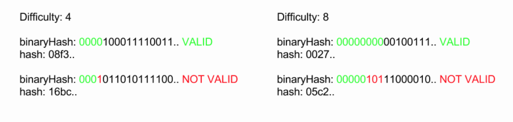
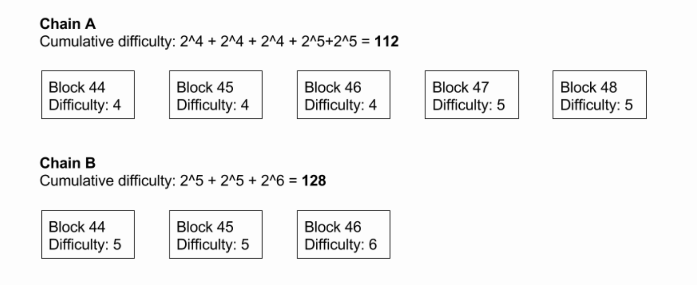

工作量证明
-----
> 查看[原文链接](https://lhartikk.github.io/jekyll/update/2017/07/13/chapter2.html)

#### 概览
在这一节，将会介绍一下一种简单的 `工作量证明(Pow)`模式。在第一节中，任何人都可以很轻松地向链中添加一个区块。通过Proof-of-work，我们引入了一个需要解决的计算难题，然后才能将块添加到区块链中。试图解决这个难题通常被称为“挖矿”。  

通过Proof-of-work，我们还可以（大致）控制块引入区块链的频率间隔，这是通过改变拼图的难度来完成的。如果过于频繁地开采块，则难题的难度会增加，反之亦然。  

需要知道的是，我们尚未在本章中介绍交易，也就是说，对于成功挖到区块的矿工，是没有奖励的。通常在加密货币中，矿工因寻找区块而获得奖励，但在我们的区块链中并非如此。  

可以在此处找到将在本章中实现的[完整代码](https://github.com/lhartikk/naivecoin/tree/chapter2)。

#### 难度，随机数和工作证明难题
我们将为块结构添加两个新属性：`difficulty`(难度)和`nonce`(随机数）。要理解这些含义，我们必须首先介绍工作量证明难题。  
工作证明难题是找到块哈希 -- 具有前缀的特定数量的零。`difficulty`属性定义块哈希必须具有多少前缀零，以使块有效。从哈希的二进制格式检查前缀零。  
以下是针对各种困难的有效和无效哈希的一些示例：  

检查哈希在难度方面是否正确的代码：
```js
const hashMatchesDifficulty = (hash: string, difficulty: number): boolean => {
    const hashInBinary: string = hexToBinary(hash);
    const requiredPrefix: string = '0'.repeat(difficulty);
    return hashInBinary.startsWith(requiredPrefix);
};
```

为了找到满足难度的哈希，我们必须能够为块的相同内容计算不同的哈希值，就需要通过修改`nonce`参数来完成的。因为SHA256是一个散列函数，所以每当块中的任何内容发生变化时，散列都会完全不同。“挖矿”基本上只是尝试不同的随机数，直到块散列匹配难度(即hash的前缀有多少个0)。  
现在添加了难度和随机数，块结构如下所示：
```js
class Block {

    public index: number;
    public hash: string;
    public previousHash: string;
    public timestamp: number;
    public data: string;
    public difficulty: number;
    public nonce: number;

    constructor(index: number, hash: string, previousHash: string,
                timestamp: number, data: string, difficulty: number, nonce: number) {
        this.index = index;
        this.previousHash = previousHash;
        this.timestamp = timestamp;
        this.data = data;
        this.hash = hash;
        this.difficulty = difficulty;
        this.nonce = nonce;
    }
}
```
当然，创建创始块的代码也需要更新下！


#### 发现一个块
如上所述，为了找到有效的块散列，我们必须不断增加nonce，直到得到有效的散列。找到令人满意的哈希完全是一个随机过程。我们必须循环通过足够的nonces，直到找到令人满意的哈希：
```js
const findBlock = (
  index: number, 
  previousHash: string, 
  timestamp: number, 
  data: string, 
  difficulty: number
): Block => {
    let nonce = 0;
    while (true) {
        const hash: string = calculateHash(index, previousHash, timestamp, data, difficulty, nonce);
        if (hashMatchesDifficulty(hash, difficulty)) {
            return new Block(index, hash, previousHash, timestamp, data, difficulty, nonce);
        }
        nonce++;
    }
};
```
当找到该块时，它将被广播到网络，如第1章中的情况。

#### 难度共识
我们现在有办法找到并验证给定难度的哈希值，但难度如何确定？必须有一种方法让节点同意当前的难度。为此，我们介绍下一些用于计算网络中当前难度的新规则。  

让我们为网络定义以下新常量
* `BLOCK_GENERATION_INTERVAL`-- 定义找到一个块的频率。 （在比特币这个值是10分钟）
* `DIFFICULTY_ADJUSTMENT_INTERVAL` -- 定义适应网络哈希值增加或减少的频率。 （在比特币中这个值是2016个块）  

我们将块生成间隔设置为10s，将难度调整为10块。这些常量是硬编码的（写死的），不会随时间而改变。
```js
// in seconds
const BLOCK_GENERATION_INTERVAL: number = 10;

// in blocks
const DIFFICULTY_ADJUSTMENT_INTERVAL: number = 10;
```
现在我们有办法就块的难度达成一致。对于生成的每10个块，我们检查生成这些块所花费的时间是大于还是小于预期时间。预期时间计算如下：BLOCK_GENERATION_INTERVAL * DIFFICULTY_ADJUSTMENT_INTERVAL.预期时间表示哈希值恰好与当前难度匹配的情况。  

如果所花费的时间比预期的难度大至少两倍或更小，我们要么将难度增加或减少一。难度调整的代码如下：
```js
const getDifficulty = (aBlockchain: Block[]): number => {
    const latestBlock: Block = aBlockchain[blockchain.length - 1];
    if (latestBlock.index % DIFFICULTY_ADJUSTMENT_INTERVAL === 0 && latestBlock.index !== 0) {
        return getAdjustedDifficulty(latestBlock, aBlockchain);
    } else {
        return latestBlock.difficulty;
    }
};

const getAdjustedDifficulty = (latestBlock: Block, aBlockchain: Block[]) => {
    const prevAdjustmentBlock: Block = aBlockchain[blockchain.length - DIFFICULTY_ADJUSTMENT_INTERVAL];
    const timeExpected: number = BLOCK_GENERATION_INTERVAL * DIFFICULTY_ADJUSTMENT_INTERVAL;
    const timeTaken: number = latestBlock.timestamp - prevAdjustmentBlock.timestamp;
    if (timeTaken < timeExpected / 2) {
        return prevAdjustmentBlock.difficulty + 1;
    } else if (timeTaken > timeExpected * 2) {
        return prevAdjustmentBlock.difficulty - 1;
    } else {
        return prevAdjustmentBlock.difficulty;
    }
};
```

#### 时间戳验证
在第一节的版本中，时间戳没有任何验证规则。事实上，它可能是客户决定产生的任何东西。现在，由于timeTaken变量（在前面的代码片段中）是根据块的时间戳计算的，因此需要增加难度调整。  
为了缓解引入虚假时间戳的攻击以便操纵难度，引入了以下规则：
1. 如果时间戳从当前时间起最多1分钟，则块有效。
2. 如果时间戳在前一个块的过去最多1分钟，则链中的块有效。
```js
const isValidTimestamp = (newBlock: Block, previousBlock: Block): boolean => {
    return ( previousBlock.timestamp - 60 < newBlock.timestamp )
        && newBlock.timestamp - 60 < getCurrentTimestamp();
}; 
```

#### 累积难度
在区块链的第1节的版本中，我们总是选择“最长”的区块链是有效的。因为引入了`difficulty`，就需要改变一下策略。就目前而言，“正确”链条不是“最长”的链条，而是具有累积难度最大的链条。换句话说，正确的链是最耗资源（= hashRate * time）的链。  

为了得到链的累积难度，我们计算每个块的`2^difficulty`并取所有这些数的总和。使用`2^difficulty`，是因为我们选择难度来表示必须以二进制格式为哈希前缀的零的数量。例如，如果我们比较5和11的难度，则需要2 ^（11-5）= 2^6 次或更多的工作才能找到具有近似难度的块。  

在下面的例子中，"Chain B”是虽然块不多，但它是“正确“的链。


在块的属性中 `difficulty`相对于`hash`(有效的hash)更重要。例如，如果`difficulty`是4并且块散列是000000a34c ...（=也满足`difficulty`为6的情况），但是在计算累积难度时仅考虑4。  

这个属性也被称为“中本聪共识”，这是他/她创造了比特币时，最重要的发明之一。在分叉的情况下，矿工必须选择他们决定放置当前资源的链（= hashRate）。由于矿工的利益是生产将被纳入区块链的区块，矿工们会被激励最终选择相同的链条。

#### 小结
工作证明难题必须具备的一个重要特性是-- 难以解决，但易于验证。找到特定的SHA256哈希值是这种问题的一个很好的简单例子。  

这一节，我们实现了难度方面的内容，节点现在必须“挖矿”才能向链中添加新块。在下一章中，我们将实现交易。  
本节完成的[代码](https://github.com/lhartikk/naivecoin/tree/chapter2)  

下一节：[交易1](./3-交易1.md)
