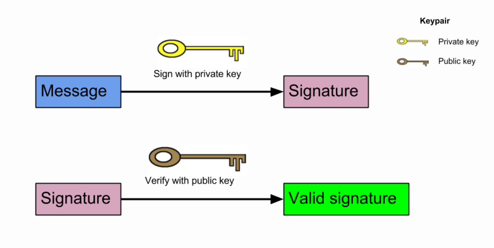
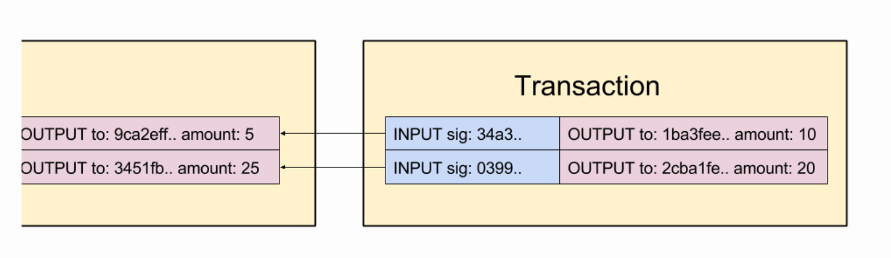
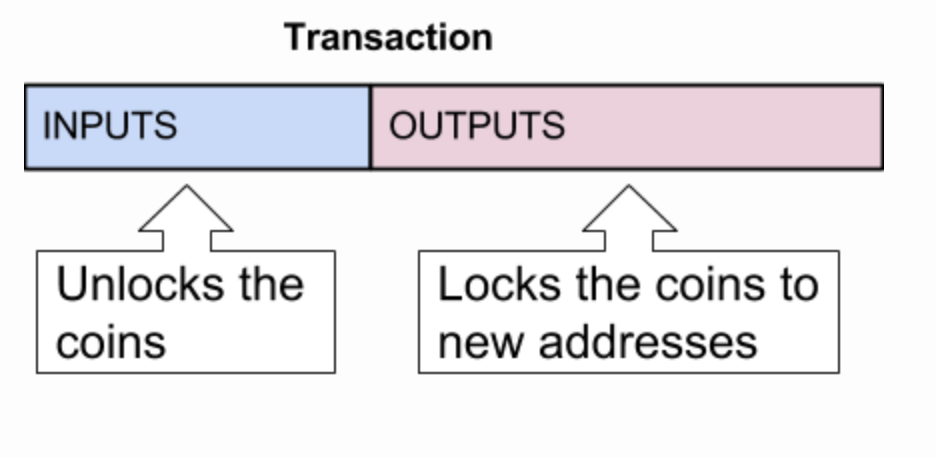

交易1
----
> 查看[原文链接](https://lhartikk.github.io/jekyll/update/2017/07/12/chapter3.html)

#### 概览
本节，我们将介绍交易的概念。一旦交易讲解完，我们的项目从“通用”区块链转变为加密货币。因此，如果我们拥有一些货币，我们可以把他们发送到一些地址进行交易。  

为了实现这个目标，我们需要接胡搜啊一些新的概念，包括：公钥加密、验证、交易输入和输出。  

本节完成代码，请移步至[这里](https://github.com/lhartikk/naivecoin/tree/chapter3).

#### 公钥加密和验证
了解完[公钥加密](https://en.wikipedia.org/wiki/Public-key_cryptography)的概念, 就会知道会有一个秘钥对：私钥和公钥。公钥由私钥生成，但是私钥不能通过公钥生成。公钥可以被安全的分享给每一个人。  

任何消息都可以使用私钥创建的`signature`来签名，而且任何人都可以通过 `signature` 和公钥来验证签名是不是由这个公钥对应的私钥生成的。


我们将使用一个名为elliptic的库来进行公钥加密，而这个库内部使用椭圆曲线（= ECDSA）。目前为止，我们有两种不同的加密函数用于加密货币中的不同目的：
1. 散列函数（SHA256） -- 为了挖矿的工作量证明（也用于区块数据的hash属性）
2. 公钥加密（ECDSA） -- 为了交易

#### 私钥和公钥（在ECDSA中）
下面是一个有效的私钥，是一个随机生成的32位字符串：
`19f128debc1b9122da0635954488b208b829879cf13b3d6cac5d1260c0fd967c`  

下面是一个有效的公钥，是'04'和一个64字节字符串连接而成：
`04bfcab8722991ae774db48f934ca79cfb7dd991229153b9f732ba5334aafcd8e7266e47076996b55a14bf9913ee3145ce0cfc1372ada8ada74bd287450313534a`  

公钥由私钥生成，将会作为数字货币的交易地址（接收者）

#### 交易概述
在写代码之前，我们先了解下关于交易的结构。交易由两部分组件构成：输入和输出。  
* 输出 -- 输出指定货币的发送位置
* 输入 -- 输入提供证据证明实际发送的货币首先存在并且由“发送者”拥有。输入始终指的是现有（未使用）的输出。


#### 交易输出
交易输出（txOut）由地址和金额组成。该地址是ECDSA公钥。这意味着，具有引用的公钥（=地址）的私钥的用户拥有这些交易货币。（可以理解为收款方）
```js
class TxOut {
    public address: string;
    public amount: number;

    constructor(address: string, amount: number) {
        this.address = address;
        this.amount = amount;
    }
}
```
#### 交易输入
交易输入（txIn）提供交易的货币来自哪里的信息。每个txIn指的是先前的输出，其中的货币是“解锁的”，带有签名。这些未锁定的输出货币才可以用于当前交易的输入。签名是为了证明只有这个公钥所指向的私钥用户才能创建该交易。
```js
class TxIn {
    public txOutId: string;
    public txOutIndex: number;
    public signature: string;
}
```
应该注意的是，txIn仅包含签名（由私钥创建），而不包含私钥本身。区块链包含公钥和签名，也不包含私钥。  
总之，也可以认为txIns解锁货币并且txOuts'重新锁定'货币：


#### 交易结构
交易本身非常简单，因为我们现在已经定义了txIns和txOuts。
```js
class Transaction {
    public id: string;
    public txIns: TxIn[];
    public txOuts: TxOut[];
}
```

#### 交易ID
交易ID通过计算交易的内容的哈希得来。但是，txIds的签名不包含在交易的哈希中，因为它将在之后才会添加到交易中。  
```js
const getTransactionId = (transaction: Transaction): string => {
    const txInContent: string = transaction.txIns
        .map((txIn: TxIn) => txIn.txOutId + txIn.txOutIndex)
        .reduce((a, b) => a + b, '');

    const txOutContent: string = transaction.txOuts
        .map((txOut: TxOut) => txOut.address + txOut.amount)
        .reduce((a, b) => a + b, '');

    return CryptoJS.SHA256(txInContent + txOutContent).toString();
};
```

#### 交易签名
交易的内容不能被改变，这一点十分重要。由于交易是公开的，任何人都可以查看交易信息，甚至在它们被包含在区块链之前。  

对交易的输入进行签名时，只会签名txId.如果交易的任何内容改变了，txId也必须改变，使交易和签名无效。
```js
const signTxIn = (transaction: Transaction, txInIndex: number,
                  privateKey: string, aUnspentTxOuts: UnspentTxOut[]): string => {
    const txIn: TxIn = transaction.txIns[txInIndex];
    const dataToSign = transaction.id;
    const referencedUnspentTxOut: UnspentTxOut = findUnspentTxOut(txIn.txOutId, txIn.txOutIndex, aUnspentTxOuts);
    const referencedAddress = referencedUnspentTxOut.address;
    const key = ec.keyFromPrivate(privateKey, 'hex');

    const signature: string = toHexString(key.sign(dataToSign).toDER());

    return signature;
};
```

我们来梳理下，如果某个人想要修改交易的话，会发生什么：
1. 攻击者运行一个节点并接收一个包含内容的交易：“使用txId `0x555`从地址AAA向BBB发送10个货币”。
2. 攻击者将接受者地址改为`CCCC`然后转播到整个网络中。现在交易的内容变成了：“从地址AAA向CCC发送10个货币”
3. 但是，交易的内容改变了，txId(交易的ID)就不再有效。新的有效的交易ID应该是：`0x567...`
4. 攻击者改变了 txId,那交易的签名就失效了，签名只和之前的txId关联。
5. 其他节点不接受修改后的交易，因为无论哪种方式，它都是无效的。

#### 未花费的交易输出
交易的输入始终引用的是未花费的交易输出（uTxO）。可以确切的说，当您在区块链中拥有一些货币时，您实际拥有的是未使用的事务输出列表，其公钥与您拥有的私钥匹配。  

在交易验证的方面，我们只关注未花费的交易输出列表，以确定交易是否有效。未花费的交易输出列表总是可以从当前的区块链获取到。 在此实现中，我们将在处理时更新未使用的事务输出列表，并将事务包含在区块链中。  

UnspentTxOut(未花费的交易输出)的数据结构如下所示：
```js
class UnspentTxOut {
    public readonly txOutId: string;
    public readonly txOutIndex: number;
    public readonly address: string;
    public readonly amount: number;

    constructor(txOutId: string, txOutIndex: number, address: string, amount: number) {
        this.txOutId = txOutId;
        this.txOutIndex = txOutIndex;
        this.address = address;
        this.amount = amount;
    }
}
```
UnspentTxOuts(未花费的交易输出列表)数据结构：
```js
let unspentTxOuts: UnspentTxOut[] = [];
```
#### 更新未花费交易输出列表
每次向链中添加新块时，我们都必须更新unspentTxOuts 这个列表。这是因为，新的交易总会花掉一些已经存在的交易输出，并新建新的未花费的交易输出。   

为了解决这个问题，我们将首先从新块中检索所有新的未使用的事务输出：
```js
 const newUnspentTxOuts: UnspentTxOut[] = newTransactions
        .map((t) => {
            return t.txOuts.map((txOut, index) => new UnspentTxOut(t.id, index, txOut.address, txOut.amount));
        })
        .reduce((a, b) => a.concat(b), []);
```

我们还需要知道块新的交易中，消费了哪些交易输出，这个数据记为`consumedTxOuts`。这将通过检查新交易的输入来解决：
```js
 const consumedTxOuts: UnspentTxOut[] = newTransactions
        .map((t) => t.txIns)
        .reduce((a, b) => a.concat(b), [])
        .map((txIn) => new UnspentTxOut(txIn.txOutId, txIn.txOutIndex, '', 0));
```

最后，我们可以通过删除`consumeTxOuts`并将`newUnspentTxOuts`添加到现有的交易输出来生成新的未花费的交易输出。
```js
  const resultingUnspentTxOuts = aUnspentTxOuts
      .filter(((uTxO) => !findUnspentTxOut(uTxO.txOutId, uTxO.txOutIndex, consumedTxOuts)))
      .concat(newUnspentTxOuts);
```

上述代码和功能包含在`updateUnspentTxOuts`方法中。 应该注意，只有在块（以及块本身）中的交易已经被验证之后才调用该方法。

#### 交易验证
我们现在可以最终规定使交易有效的规则：

###### 正确的交易结构

交易必须符合已定义的Transaction、TxIn和TxOut 类
```js
  const isValidTransactionStructure = (transaction: Transaction) => {
        if (typeof transaction.id !== 'string') {
            console.log('transactionId missing');
            return false;
        }
        ...
       //check also the other members of class
    }
```
###### 有效的交易ID

必须正确计算交易中的id。
```js
   if (getTransactionId(transaction) !== transaction.id) {
        console.log('invalid tx id: ' + transaction.id);
        return false;
    }
```
###### 有效交易输入(txIns)
txIns中的签名必须有效，并且必须引用未花费的输出。
```js
const validateTxIn = (txIn: TxIn, transaction: Transaction, aUnspentTxOuts: UnspentTxOut[]): boolean => {
    const referencedUTxOut: UnspentTxOut =
        aUnspentTxOuts.find((uTxO) => uTxO.txOutId === txIn.txOutId && uTxO.txOutId === txIn.txOutId);
    if (referencedUTxOut == null) {
        console.log('referenced txOut not found: ' + JSON.stringify(txIn));
        return false;
    }
    const address = referencedUTxOut.address;

    const key = ec.keyFromPublic(address, 'hex');
    return key.verify(transaction.id, txIn.signature);
};
```

###### 有效的交易输出(txOut)
输出中指定的值的总和必须等于输入中指定的值的总和。如果您引用包含50个硬币的输出，则新输出中的值之和也必须为50个硬币。
```js
const totalTxInValues: number = transaction.txIns
        .map((txIn) => getTxInAmount(txIn, aUnspentTxOuts))
        .reduce((a, b) => (a + b), 0);

const totalTxOutValues: number = transaction.txOuts
    .map((txOut) => txOut.amount)
    .reduce((a, b) => (a + b), 0);

if (totalTxOutValues !== totalTxInValues) {
    console.log('totalTxOutValues !== totalTxInValues in tx: ' + transaction.id);
    return false;
}

```

#### Coinbase交易
交易输入必须始终指未花费的交易输出，但是区块链中的初始货币从何处来的呢？ 为了解决这个问题，引入了一种特殊类型的交易：coinbase交易。  

coinbase交易只包含一个输出，没有输入。 这意味着coinbase交易增加了新的货币。 我们指定coinbase输出的金额为50个货币。
```js
const COINBASE_AMOUNT: number = 50;
```
coinbase交易始终是块中的第一个交易，并且它会被放入矿工挖出来的那个块中。 coinbase交易的奖励对矿工来说是一种激励：如果你找到了这个区块，你就可以收集50个货币。  

我们将块高度添加到coinbase交易的输入中。这是为了确保每个coinbase交易具有唯一的txId。例如，如果没有这个规则，那么表示“给地址0xabc提供50个硬币”的交易将始终具有相同的txId。  

coinbase交易的验证与“正常”交易的验证略有不同：
```js
const validateCoinbaseTx = (transaction: Transaction, blockIndex: number): boolean => {
    if (getTransactionId(transaction) !== transaction.id) {
        console.log('invalid coinbase tx id: ' + transaction.id);
        return false;
    }
    if (transaction.txIns.length !== 1) {
        console.log('one txIn must be specified in the coinbase transaction');
        return;
    }
    if (transaction.txIns[0].txOutIndex !== blockIndex) {
        console.log('the txIn index in coinbase tx must be the block height');
        return false;
    }
    if (transaction.txOuts.length !== 1) {
        console.log('invalid number of txOuts in coinbase transaction');
        return false;
    }
    if (transaction.txOuts[0].amount != COINBASE_AMOUNT) {
        console.log('invalid coinbase amount in coinbase transaction');
        return false;
    }
    return true;
};
```

#### 小结
在本节中，我们介绍了区块链中交易的概念。基本思路很简单：我们在交易输入中引用未花费的输出，并使用签名来显示解锁部分是有效的。 然后我们使用输出将它们“重新锁定”到接收者的地址。  

但是，创建交易仍然非常困难。我们必须手动创建交易的输入和输出，并使用我们的私钥对其进行签名。当我们在下一章介绍钱包时，将会改变这一点。  

此时，我们尚未实现交易广播：要在区块链中包含交易，就必须自己挖矿。 这也是我们尚未引入交易费概念的原因。  

本节完成代码，请移步至[这里](https://github.com/lhartikk/naivecoin/tree/chapter3).  

下一节：[钱包](./4-钱包.md)