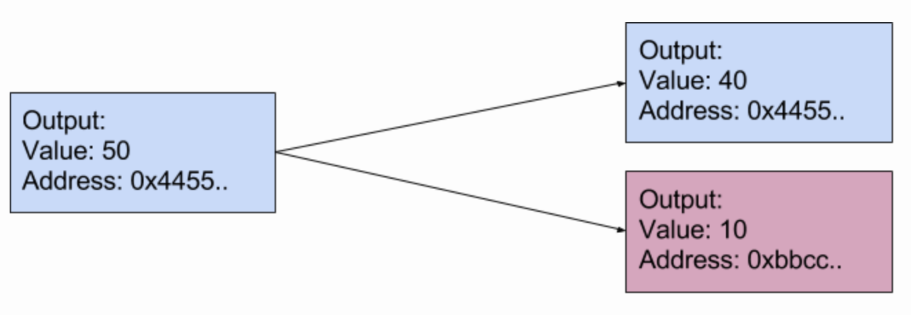
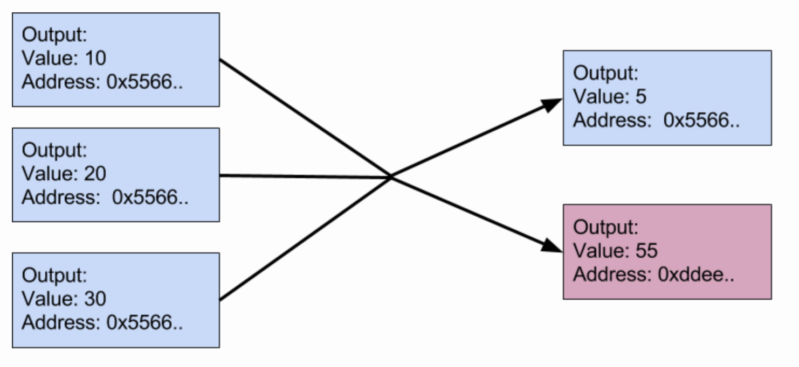

钱包
----
> 查看[原文链接](https://lhartikk.github.io/jekyll/update/2017/07/11/chapter4.html)

#### 概览
钱包的目标是为用户创建一个交互的界面。  

最终，用户必须能够：
1. 创建一个新钱包（即私钥）
2. 查看钱包的余额
3. 将货币发送到其他地址

而且，完成以上的操作，用户并不需要理解txIns或txOuts如何工作。就像在比特币中：您将比特币发送到其他地址，并公开自己的地址，方便其他用户可以发送货币。  

本节完整代码，请移步至[这里](https://github.com/lhartikk/naivecoin/tree/chapter4).  

#### 生成和存储私钥
在本节中，我们将使用最简单的方法来处理钱包的生成和存储：我们将在文件`node/wallet/private_key`中生成一个未加密的私钥。
```js
const privateKeyLocation = 'node/wallet/private_key';

const generatePrivatekey = (): string => {
    const keyPair = EC.genKeyPair();
    const privateKey = keyPair.getPrivate();
    return privateKey.toString(16);
};

const initWallet = () => {
    //let's not override existing private keys
    if (existsSync(privateKeyLocation)) {
        return;
    }
    const newPrivateKey = generatePrivatekey();

    writeFileSync(privateKeyLocation, newPrivateKey);
    console.log('new wallet with private key created');
};
```
并且可以根据私钥来计算公钥（=地址）。
```js
const getPublicFromWallet = (): string => {
    const privateKey = getPrivateFromWallet();
    const key = EC.keyFromPrivate(privateKey, 'hex');
    return key.getPublic().encode('hex');
};
```
需要注意的是，以未加密的格式存储私钥是非常不安全的。 我们这样做只是为了让事情变得简单。此外，钱包仅支持一个私钥，因此您需要生成一个新钱包以获取新的公共地址。  

#### 钱包余额
根据上一节，我们可以知道：你在区块链中所拥有的货币，实际上指的是是那些属于你的未花费的输出列表（即那些包含你公钥的输出的为花费列表）。  

这意味着计算给定地址的余额非常简单：只需将该地址“拥有”的所有未花费的交易输出加起来：
```js
const getBalance = (address: string, unspentTxOuts: UnspentTxOut[]): number => {
    return _(unspentTxOuts)
        .filter((uTxO: UnspentTxOut) => uTxO.address === address)
        .map((uTxO: UnspentTxOut) => uTxO.amount)
        .sum();
};
```

如代码所示，查询某个地址的余额不需要私钥，也就是说，任何人都可以查询一个地址的余额。

#### 生成交易
当发送货币时，用户应该忽视交易输入和输出的概念。但是如果用户A有50个硬币的余额，即在单个交易输出中并且用户想要向用户B发送10个硬币，会发生什么？  

在这种情况下，解决方案是 -- 将10个硬币发送到用户B的地址，将40个硬币发送回用户A. 全部的交易输出必须都被花掉，因此，在将硬币分配给新输出时，必须先要“拆分”。  

简单的情况下，就如下面图片中的展示（txIns未显示, 其实这比交易中"全部的交易输出"都保存在txIns中）：


让我们再看看复杂的场景：
1. 一开始，用户C没有任何货币
2. 之后，用户C收到了3笔交易，分别获得了10、20、30硬币
3. 再后来，用户C想要向用户D转账55个硬币，那交易将会变成怎么样呢？

在这种情况下，三个输出必须全被都要被用掉，并且最后必须是55个硬币到用户D的账户和5个硬币返回给用户C.


我们来用代码实现上面的逻辑。  
首先，我们将创建交易输入。我们将遍历未花费的交易输出，直到这些输出的总和大于或等于我们想要发送的数量。
```js
const findTxOutsForAmount = (amount: number, myUnspentTxOuts: UnspentTxOut[]) => {
    let currentAmount = 0;
    const includedUnspentTxOuts = [];
    for (const myUnspentTxOut of myUnspentTxOuts) {
        includedUnspentTxOuts.push(myUnspentTxOut);
        currentAmount = currentAmount + myUnspentTxOut.amount;
        if (currentAmount >= amount) {
            // 找零
            const leftOverAmount = currentAmount - amount;
            return {includedUnspentTxOuts, leftOverAmount}
        }
    }
    throw Error('not enough coins to send transaction');
};
```
如代码所示，我们还将计算`leftOverAmount`，这是我们将发送回用户C地址的值（即 找零钱）。  

现在我们有了未花费的交易输出列表，我们可以创建交易的输入(txIns)：
```js
const toUnsignedTxIn = (unspentTxOut: UnspentTxOut) => {
    const txIn: TxIn = new TxIn();
    txIn.txOutId = unspentTxOut.txOutId;
    txIn.txOutIndex = unspentTxOut.txOutIndex;
    return txIn;
};
const {includedUnspentTxOuts, leftOverAmount} = findTxOutsForAmount(amount, myUnspentTxouts);
const unsignedTxIns: TxIn[] = includedUnspentTxOuts.map(toUnsignedTxIn);
```

接下来，将会创建交易的两笔输出（一笔付款，一笔找零）。当然，如果txIns 总额和需要付的款恰好相等，就不会创建找零的输出。
```js
const createTxOuts = (receiverAddress:string, myAddress:string, amount, leftOverAmount: number) => {
  const txOut1: TxOut = new TxOut(receiverAddress, amount);
  if (leftOverAmount === 0) {
      return [txOut1]
  } else {
      const leftOverTx = new TxOut(myAddress, leftOverAmount);
      return [txOut1, leftOverTx];
  }
};
```

最后，我们计算交易的ID并给交易输入进行签名：
```js
const tx: Transaction = new Transaction();
tx.txIns = unsignedTxIns;
// 创建输出
tx.txOuts = createTxOuts(receiverAddress, myAddress, amount, leftOverAmount);
// 计算交易ID
tx.id = getTransactionId(tx);

// 给输入签名
tx.txIns = tx.txIns.map((txIn: TxIn, index: number) => {
    txIn.signature = signTxIn(tx, index, privateKey, unspentTxOuts);
    return txIn;
});
```

#### 使用钱包
我们还需要增加一个使用钱包的功能的接口。
```js
 app.post('/mineTransaction', (req, res) => {
    const address = req.body.address;
    const amount = req.body.amount;
    const resp = generatenextBlockWithTransaction(address, amount);
    res.send(resp);
});
```
如代码所示，用户只需要提供交易的地址和金额，剩下的事情，都交给了节点进行计算。

#### 小节
本小节，我们通过交易的生成实现了一个简单的未加密的钱包。虽然我们的这个交易生成算法不能创建具有2个以上交易输出的交易，但是我们要知道，区块链本身是支持任意数量的输出的。  

此外，在区块链中包含所需交易的唯一方法就是去挖矿。 但是目前节点还不会去交换尚未包含在区块链中的交易的有关信息。我们将再下一节去讨论。  

本节完整代码，请移步至[这里](https://github.com/lhartikk/naivecoin/tree/chapter4).  

下一节：[交易2](./5-交易2.md)


