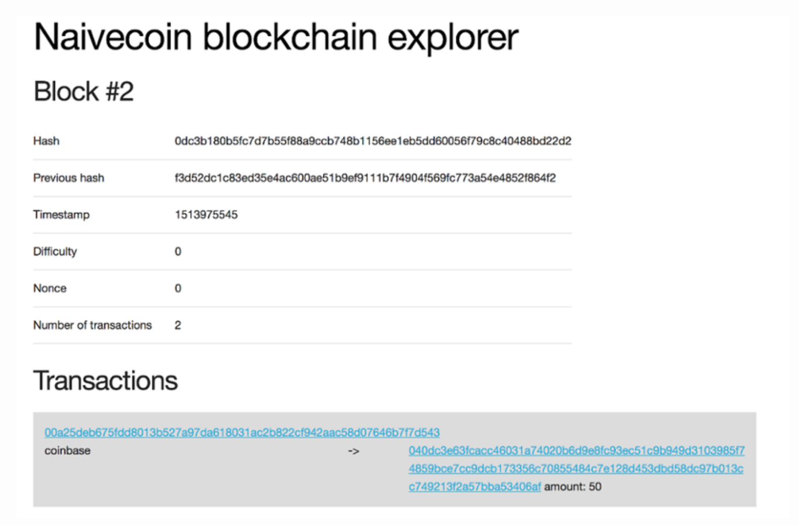
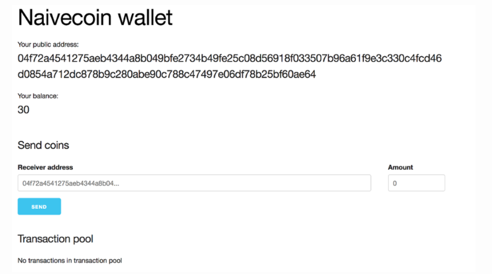

UI界面
----
> 查看[原文链接](https://lhartikk.github.io/jekyll/update/2017/07/09/chapter6.html)

#### 概览
在本节中，我们将为钱包添加UI并为区块链创建区块链资源管理器。 我们的节点已经通过HTTP接口公开其功能，因此我们将创建一个网页，向这些端点发出请求并可视化结果。  

为了实现这一切，我们必须为节点添加一些额外的接口和逻辑，例如：有关块和交易的查询、有关特定地址信息查询。  

本节完整代码，请移步至[这里](https://github.com/lhartikk/naivecoin/tree/chapter6).  
UI部分代码，请移步至[这里](https://github.com/lhartikk/naivecoin-ui)

#### 新建节点
我们添加一个接口：如果已知哈希值，可以查询块信息。
```js
app.get('/block/:hash', (req, res) => {
    const block = _.find(getBlockchain(), {'hash' : req.params.hash});
    res.send(block);
}); 
```

查询特定交易接口：
```js
    app.get('/transaction/:id', (req, res) => {
        const tx = _(getBlockchain())
            .map((blocks) => blocks.data)
            .flatten()
            .find({'id': req.params.id});
        res.send(tx);
    });
```

我们还想展示有关特定地址的信息。现在我们返回该地址的未花费输出列表，因为我们可以计算出该地址的总余额
```js
app.get('/address/:address', (req, res) => {
    const unspentTxOuts: UnspentTxOut[] =
        _.filter(getUnspentTxOuts(), (uTxO) => uTxO.address === req.params.address)
    res.send({'unspentTxOuts': unspentTxOuts});
});
```
我们还可以添加有关给定地址的已花费输出的交易信息，以便可视化给定地址的完整历史记录。

#### 前端技术
我们将使用Vue.js来实现钱包和区块链资源管理器的UI部分。 由于本教程不是关于前端开发，因此我们不会在代码方面介绍前端部分。 可以在[此处](https://github.com/lhartikk/naivecoin-ui)找到UI代码的仓库。

#### 区块链管理器
Blockchain explorer 是一个用于可视化区块链状态的网站。区块链资源管理器的典型用例是：检查给定地址的余额 和 验证给定交易是否包含在区块链中。  

在我们的例子中，我们只是向节点发出一个http请求，并以一种有意义的方式显示响应。我们从未提出修改区块链状态的任何请求，因此构建区块链资源管理器就是以可视方式展示节点提供的信息。  

UI截图如下：



#### 钱包UI界面
对于钱包UI，我们将创建一个类似于区块链资源管理器的网站。 用户应该能够发送货币并查看地址的余额。 我们还将显示交易池。  

截图如下：


  
本节完整代码，请移步至[这里](https://github.com/lhartikk/naivecoin/tree/chapter6).  
UI部分代码，请移步至[这里](https://github.com/lhartikk/naivecoin-ui)